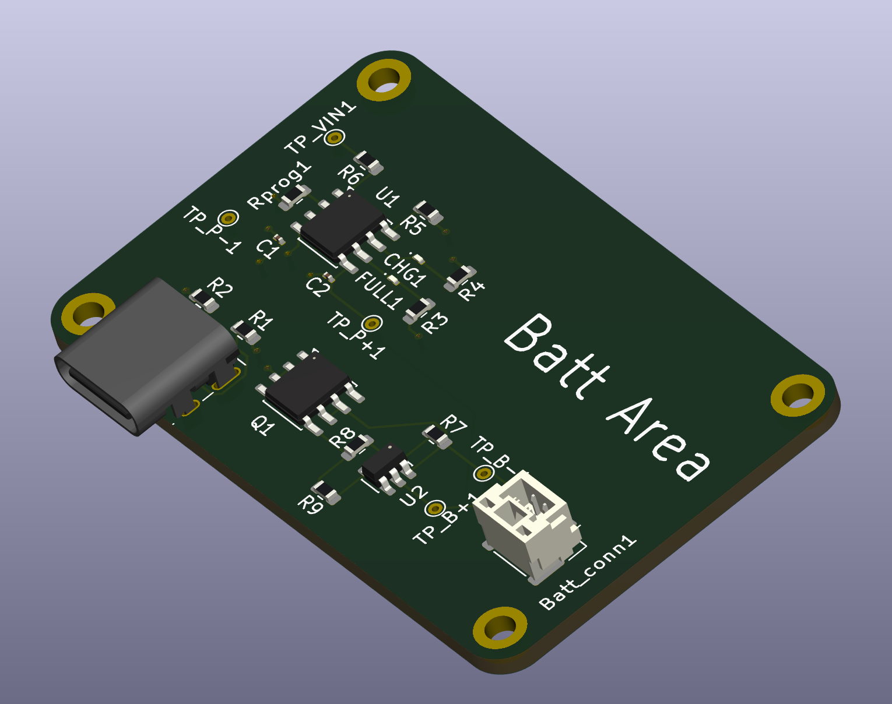

# Battery Power Management Board 4-Layer

## Description
This is a 4-layer PCB design for a complete lithium-ion/polymer battery power management system. The board integrates battery charging, protection, and power distribution functionality. The 4-layer stackup provides improved thermal management, better power distribution, and enhanced electromagnetic compatibility. This design is ideal for portable electronics, IoT devices, and any application requiring safe and efficient single-cell Li-ion/LiPo battery management.

## Features
- 4-layer PCB design for optimal performance:
  - Enhanced thermal dissipation
  - Improved power plane distribution
  - Better EMI/EMC characteristics
  - Reduced electrical noise
- TP4056 standalone linear battery charger IC
  - 1A charging current capability
  - 4.2V ±1% charge voltage precision
  - Input voltage range: 4.0V to 8.0V
  - Suitable for single-cell Li-ion/LiPo batteries
- DW01A battery protection IC
  - Overcharge protection
  - Over-discharge protection
  - Overcurrent protection
  - Short circuit protection
- USB Type-C connector for charging
- Battery connection terminals
- LED charging status indicators
- Compact and professional layout

