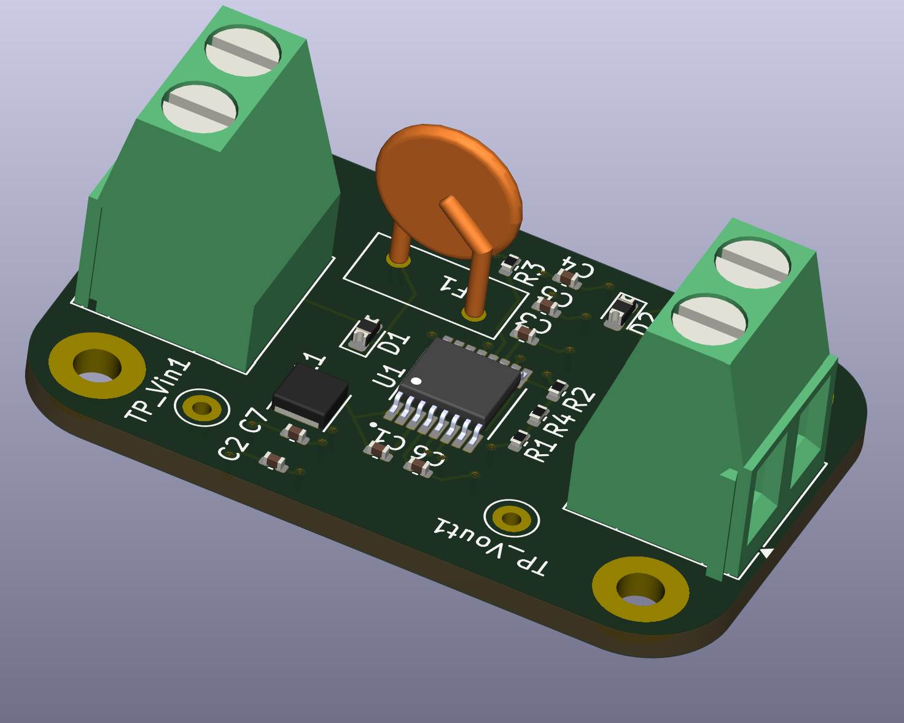

# Buck Converter 4-Layer Board

## Description
This is a 4-layer PCB design for a buck converter (step-down DC-DC converter) circuit. The 4-layer stackup provides improved thermal management, better power distribution, and enhanced electromagnetic compatibility. Buck converters are highly efficient switching regulators that step down voltage from a higher input voltage to a lower output voltage, making them ideal for power supply applications.

## Features
- 4-layer PCB design for optimal performance:
  - Enhanced thermal dissipation
  - Improved power plane distribution
  - Better EMI/EMC characteristics
  - Reduced switching noise
- Step-down DC-DC voltage conversion
- High efficiency switching regulator topology
- Suitable for various power supply applications
- Compact and professional layout

