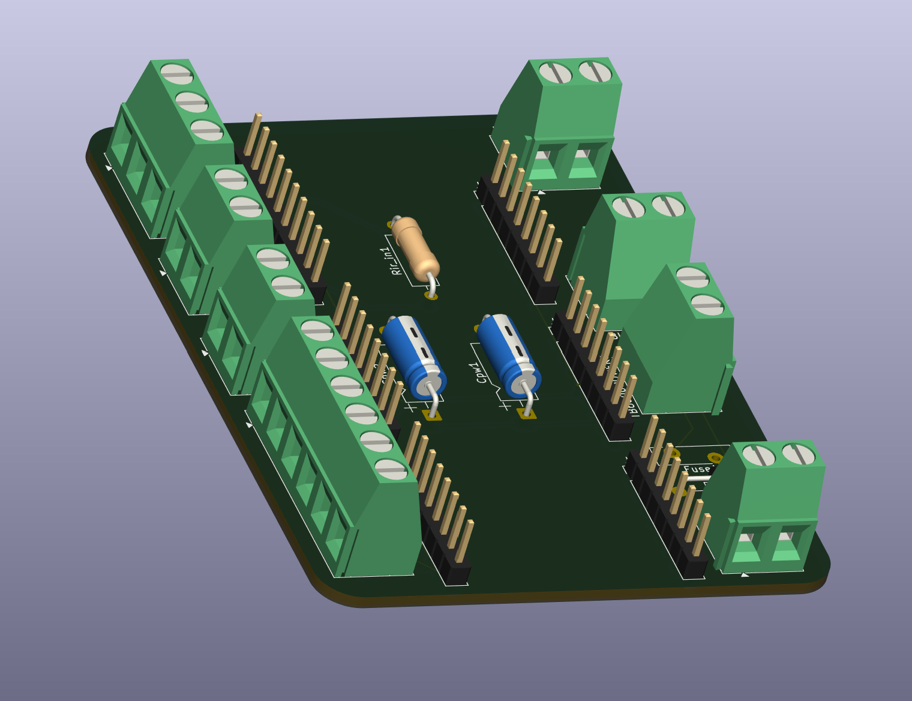

# Conveyor Belt Arduino Mega Board

## Description
This is a custom PCB designed to interface with an Arduino Mega for conveyor belt control systems. The board provides the necessary connections and circuitry to control conveyor belt motors, sensors, and other peripherals through the Arduino Mega microcontroller.

## Features
- Arduino Mega compatible interface
- Designed for conveyor belt automation
- Multiple I/O connections for sensors and actuators
- Integrated power and signal conditioning

