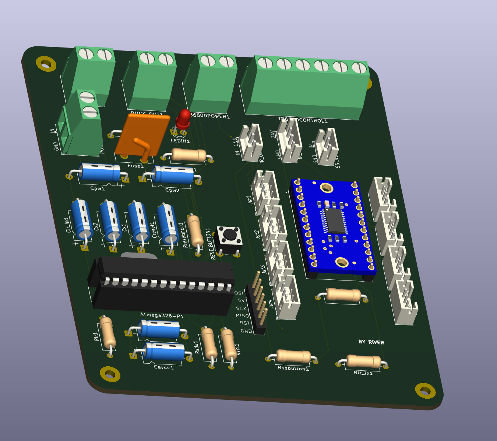

# Conveyor Belt Main Board

## Description
This is the main control board for an automated conveyor belt system. The board features an ATmega328P microcontroller, TB6600 stepper motor driver interface, I2C multiplexer (TCA9548A) for managing multiple sensors, and various connectors for IR sensors and control inputs. It provides complete control and monitoring for industrial or automated conveyor systems.

## Features
- ATmega328P microcontroller for main control
- TB6600 stepper motor driver integration
- TCA9548A I2C multiplexer for multiple sensor channels (8 channels)
- E3F1-3DN1 IR sensor support for object detection
- 5V/5A buck converter for power regulation
- ISP programming header
- Multiple sensor and control connectors
- Reset and start/stop button inputs

## Components
See the [List of Components](List%20Of%20Components.txt) for detailed component specifications.

## Block Diagram

## PCB Design

