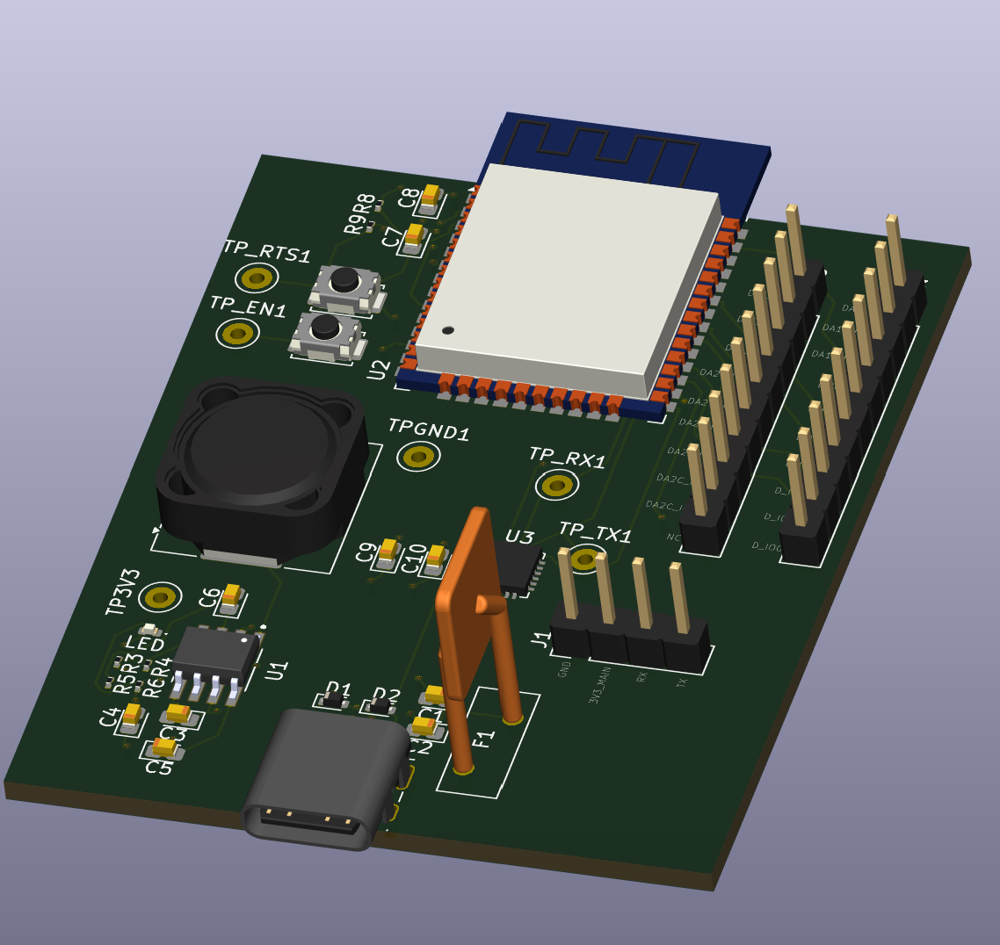

# ESP32S3 4-Layer USB-C Board

## Description
This is an advanced 4-layer PCB design featuring the ESP32-WROOM-32 module with USB-C connectivity. The 4-layer stackup provides improved signal integrity, better power distribution, and enhanced electromagnetic compatibility compared to standard 2-layer designs. This board combines modern USB-C interfacing with the powerful ESP32 platform for professional IoT and embedded applications.

## Features
- ESP32-WROOM-32 module with Wi-Fi 802.11b/g/n and Bluetooth/BLE
- USB-C connector for modern connectivity and programming
- 4-layer PCB design for superior performance:
  - Improved signal integrity
  - Better power plane distribution
  - Enhanced EMI/EMC characteristics
  - Reduced crosstalk and noise
- USB 2.0 data interface
- Suitable for professional embedded and IoT projects
- Compatible with ESP32 development ecosystem

