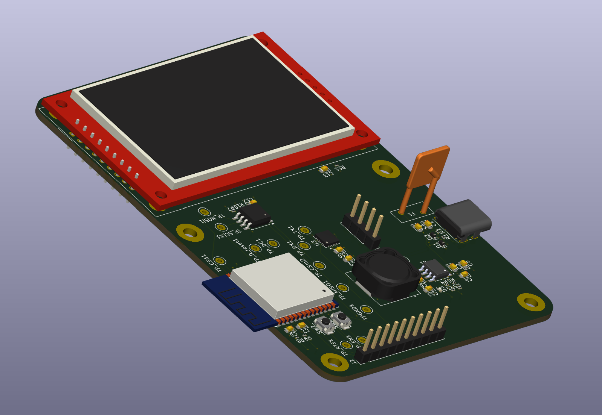

# ESP32 Memory Display Board

## Description
This is an ESP32-based board featuring an integrated SPI TFT LCD display and external SPI flash memory. The board combines wireless connectivity capabilities of the ESP32 with visual output and expandable storage, making it ideal for IoT applications requiring user interface and data logging capabilities.

## Features
- ESP32 module with Wi-Fi and Bluetooth connectivity
- ILI9341 320x240 SPI TFT LCD display
- W25Q128JVS external SPI flash memory (128Mbit / 16MiB)
- SPI interface for high-speed display and memory operations
- Compact design integrating display and storage
- Suitable for IoT dashboards, data loggers, and embedded UI applications

