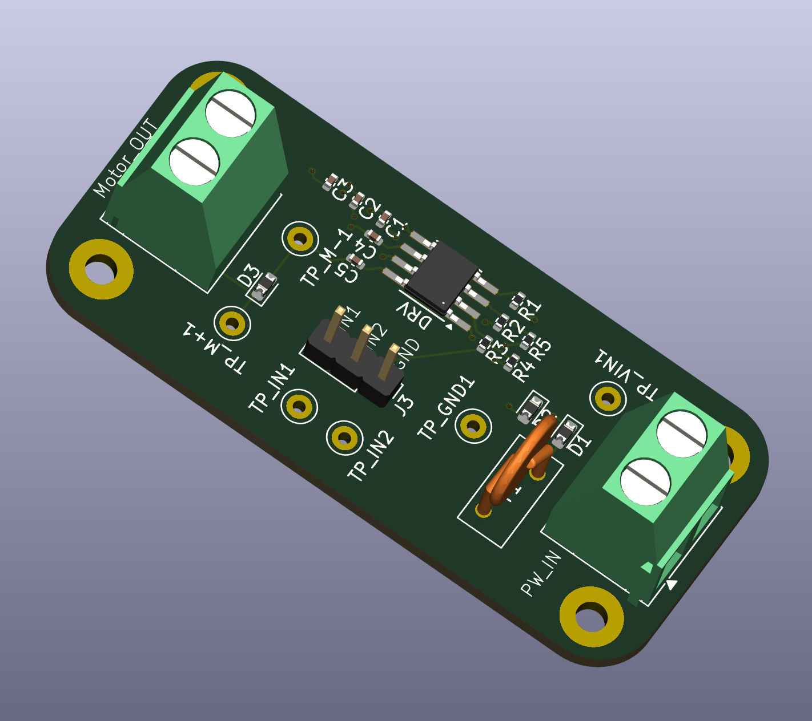

# Motor Driver 4-Layer Board

## Description
This is a 4-layer PCB design for a brushed DC motor driver circuit featuring the DRV8871DDA motor driver IC. The 4-layer stackup provides improved thermal management, better power distribution, and enhanced electromagnetic compatibility. This motor driver board supports PWM control for speed regulation and is capable of driving brushed DC motors with high efficiency and current limiting protection.

## Features
- 4-layer PCB design for optimal performance:
  - Enhanced thermal dissipation
  - Improved power plane distribution
  - Better EMI/EMC characteristics
  - Reduced electrical noise
- DRV8871DDA H-bridge motor driver IC
- PWM control for motor speed regulation
- Operating voltage up to 45V
- Continuous output current up to 3.6A
- Built-in current limiting protection
- Suitable for brushed DC motor control applications
- Compact and professional layout

