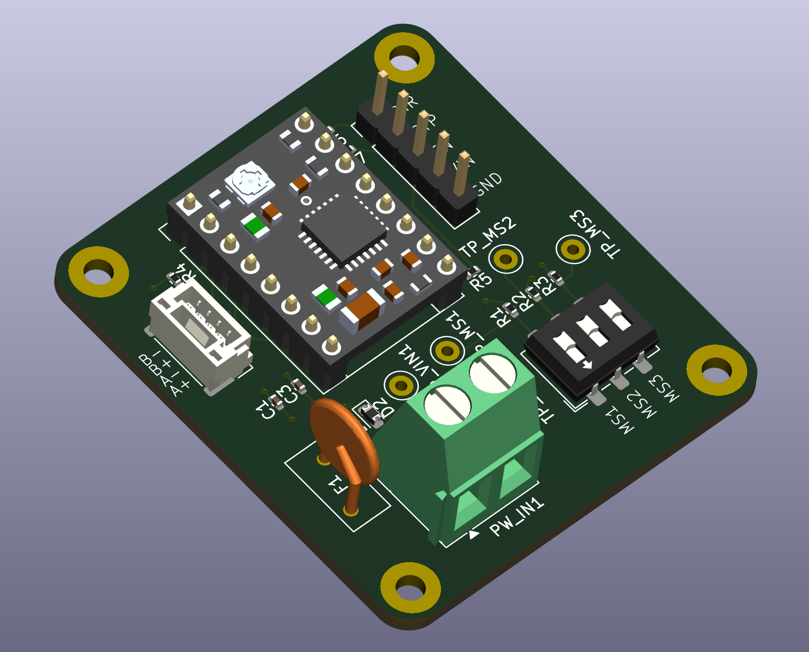

# Stepper Motor Driver 4-Layer Board

## Description
This is a 4-layer PCB design for a stepper motor driver circuit featuring the A4988 stepper motor driver IC. The 4-layer stackup provides improved thermal management, better power distribution, and enhanced electromagnetic compatibility. This driver board supports microstepping control for smooth motor operation and is capable of driving bipolar stepper motors with high efficiency and built-in protection features.

## Features
- 4-layer PCB design for optimal performance:
  - Enhanced thermal dissipation
  - Improved power plane distribution
  - Better EMI/EMC characteristics
  - Reduced electrical noise
- A4988 stepper motor driver IC (Pololu compatible)
- Microstepping support (full, half, 1/4, 1/8, 1/16 step modes)
- Operating voltage up to 35V
- Continuous output current up to 2A per coil
- Built-in translator for step and direction control
- Overcurrent and thermal shutdown protection
- Compatible with standard microcontroller interfaces
- Screw terminal connections for motor and power
- Pin header for control signals
- Suitable for CNC machines, 3D printers, and robotics applications
- Compact and professional layout

